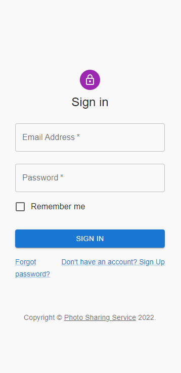
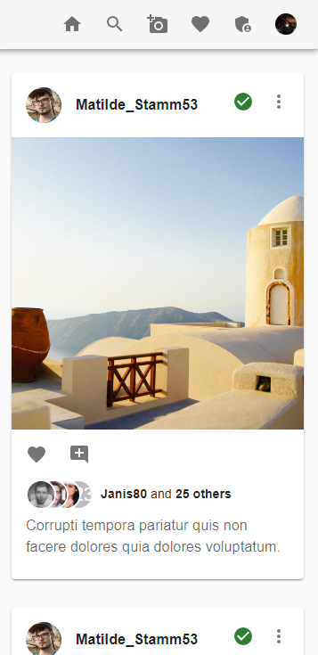
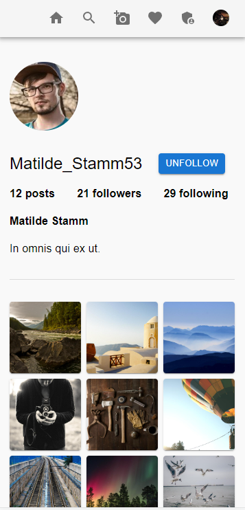
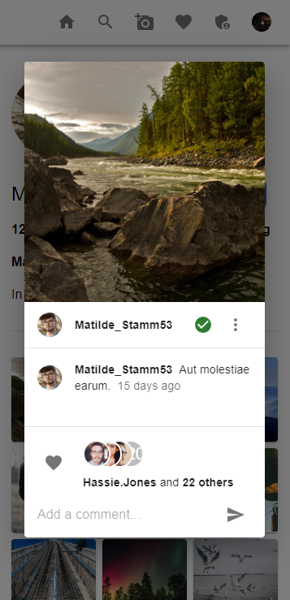
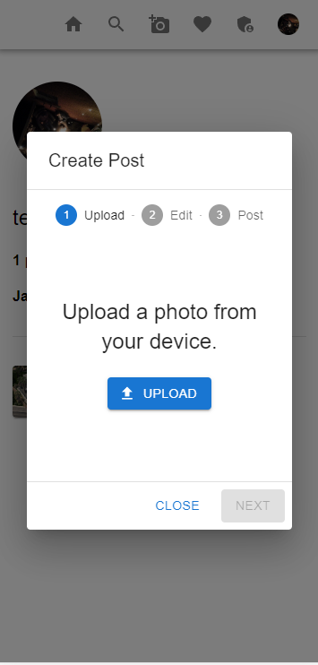
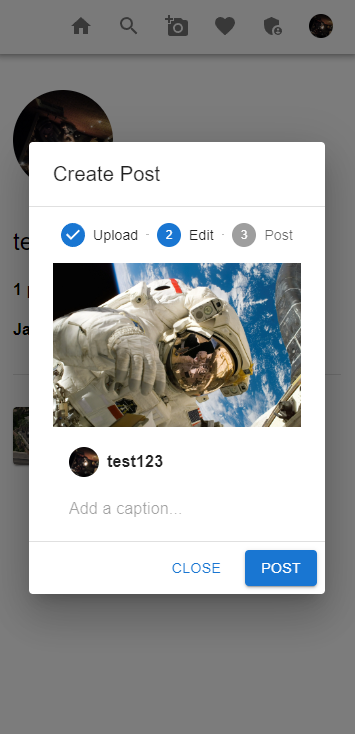
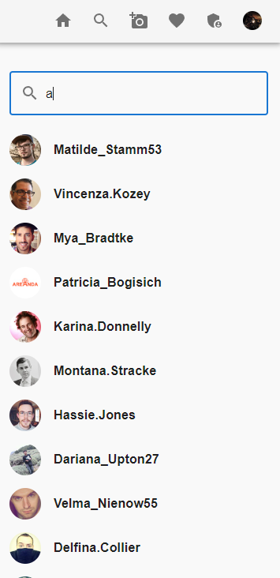

# photo-sharing-service

A simple photo sharing service built with Remix and deployed with Serverless.

## Local Setup

```
cd photo-sharing-service
npm i -g yarn
yarn install
docker-compose up
yarn run db-seed

cp .env.example .env # Fill in environment variables with appropriate values

yarn run dev
```

The application will then be available at http://localhost:3000/. Use the login credentials provided by the seed output or create a new user by navigating to http://localhost:3000/sign-up. Note that you will first have to deploy the application for the development S3 bucket to be created.

## Deploy

The application can deployed to an AWS stack using the [Serverless Framework](https://www.serverless.com/). First, you will need to configure the `sls` CLI by following [this](https://www.serverless.com/framework/docs/providers/aws/guide/credentials) setup process. Once that is done, you will be able to deploy the application by running the following command:

```
sls deploy
```

### The Stack

This application uses a number of AWS services. It's deployed to a Lambda and uses a Docker image to containerize the application. The database is served by Aurora Serverless, which is a database service that is optimized for infrequent use. It uses S3 to serve the static build files as well as to store the images uploaded by users. It also uses CloudFront to act as a CDN.

## Core Features

You can think of this application as an Instagram clone. Albeit, there are a lot of features missing, but the core functionality is very similar. Below is a list of high level features that are included in this app:

- Users can create a profile
- Users can follow each other
- Users have a feed of posts of the users they're following
- Users can post pictures
- Users can like and comment posts
- Users can delete their own posts

## Screenshots

### Sign In



### Feed



### Profile



### Post



### Upload



### Post Preview



### User Search

